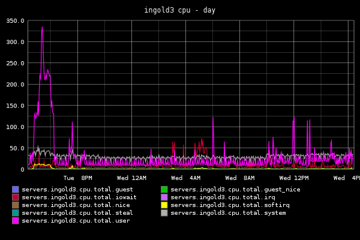

# 简介

这里我们调研了现有的一些系统包括

- Graphite

下面我们一一介绍一下这些系统，在介绍的时候，我们主要关注以下几点：

1. 功能介绍
2. 整体架构
3. 可能的瓶颈

最后，对这几种系统做一个对比。

## Graphite

### 功能介绍

Graphite 主要做了两件事情:

1. 存储 numeric time-series 数据。
2. 根据需求把所存储的数据渲染成图形。

例如，给 Graphite 输入的如下形式，列依次为：metric name, value, timestamp

    servers.ingold3.cpu.total.user 42 1286269200
    servers.ingold3.cpu.total.iowait 123 1286269200
    [one minute passes]
    servers.ingold3.cpu.total.user 44 1286269260
    servers.ingold3.cpu.total.iowait 119 1286269260

输出:

我们目前的 [Dashbord](http://graph-index.intra.douban.com/) 用的就是 Graphite.

### 整体架构

Graphite 主要包括 3 个组成部分：

- whisper，数据存储库
- carbon，后端服务程序
- webapp，渲染图形和提供一个简单的UI

这三者的关系如下图所示：

